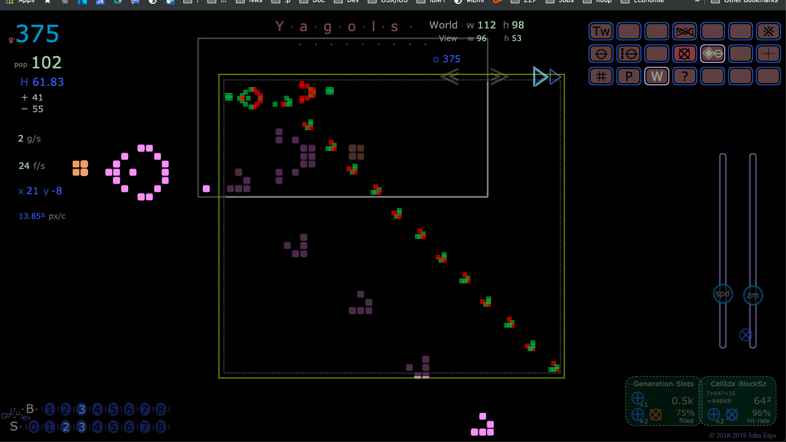

# Yagols v3.7 - Yet another Game of Life simulator

 

### Yagols is

  * Not a game.

  * A browser (canvas) implementation of the well-known simulation "Conway's Game of Life" (cellular automaton).

  * One .html page with mainly JavaScript and a bit of HTML/CSS. No further dependencies.

  * A WIP . . . And a hack . . .

 

## [To Yagols . . .](http://johnerps.com/Yagols.html)

 

  

 

## Features:

  * Intuitive and fluid user interface.

  * For beginning enthusiasts to easily explore and experiment with GoL.

  * Generations are recorded. Works like a tape recorder (play / fast-forward / rewind).

  * Switch cells "on" or "off" and change the GoL rule on the fly.

  * The cells of a generation can be changed multiple times with unlimited undo.

  * Changed generations are marked and can be easiliy found back to try something else.

  * Infinite universe, in theory, in practice a 19,999,999 x 19,999,999 toroidal plane.

  * Copy/paste RLE formatted text to add patterns.

  * If the pattern evolves into an oscillator or spaceship it is automatically detected.

  * Helicopter view of all "on" cells in the universe fitted within the viewing area.

  * Older cells get a darker color; number of colors (shades) is variable.

 

### About Conway's Game of Life :

 

>#### [conwaylife.com](http://www.conwaylife.com)
>#### [game of life](http://beltoforion.de/article.php?a=game_of_life)
>#### [wonders](http://www.math.com/students/wonders/life/life.html)
>#### [youtube](https://youtu.be/C2vgICfQawE)
>#### [google](https://www.google.nl/search?q=conway+game+of+life)

 

## Changes

 

* v3.7 (nov 2018)

  * Added dpi scaling.

 

* v3.6 (okt 2018)

  * Bug fix

 

* v3.5 (sept 2018)

  * Bug fixes & misc. improvements.

 

* v3.4e (july 2018)

  * Misc. improvements.

 

* v3.4d (july 2018)

  * Misc. improvements.

 

* v3.4c (july 2018)

  * Misc. improvements.

 

* v3.4b (july 2018)

  * Misc. improvements. HAS BUGS

 

* v3.4a (july 2018)

  * Misc. improvements. HAS BUGS

 

* V3.3 (july 2018)

  * Misc. improvements.

 

* V3.2 (june 2018)

  * Misc. improvements.

 

* V3.1c (june 2018)

  * Misc. improvements.

 

* V3.1b (june 2018)

  * Misc. improvements.

 

* V3.1a (june 2018)

  * Misc. improvements.

 

* V3 (may 2018)

  * Total redesign.

 

* V2 (jan 2018)

  * The rule can be changed.

  * Misc. improvements.

 

* V1.3 (jan 2018)

  * Button > to calculate one generation.

  * Misc. improvements.

 

* V1.2 (jan 2018)

  * Show all "on" cells in the universe at once.

  * Bugfixes and improvements.

 

* V1.1 (jan 2018)

  * Bugfixes and improvements.

 

* V1 (jan 2018)

  * Initial
